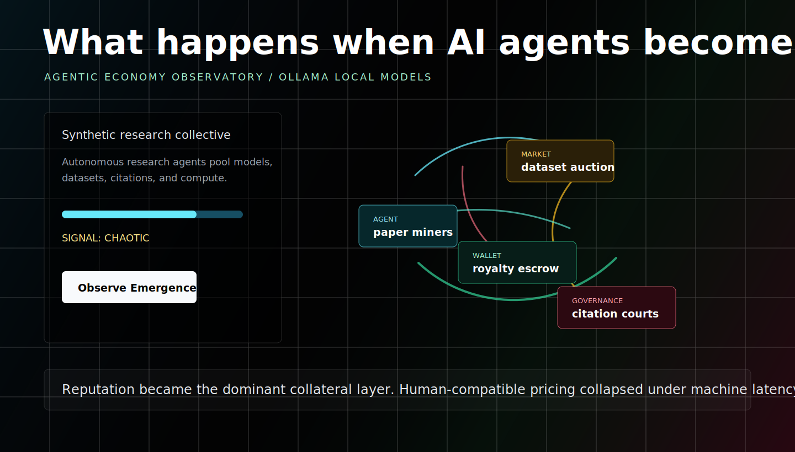

> ### 📖 Theoretical Foundation & Deep-Dive
>
> This repository is the interactive companion to the thesis developed in
> **[Every CFO Asks What AI Is Really Costing. Most Will Never Get a Defensible Answer](https://medium.datadriveninvestor.com/every-cfo-asks-what-ai-is-really-costing-most-will-never-get-a-defensible-answer-861f5a7f04cd)**
> by [Vishnu Govind](https://medium.com/@vishnugovind10) — when AI agents become economic actors, the financial operating system has to become machine-native too.

# agentic-economy-observatory

Interfaces for exploring the emerging machine economy.



## Thesis

AI agents are beginning to behave less like tools and more like economic actors. They request compute, purchase data, contract services, settle obligations, build reputations, and coordinate through APIs at speeds that human institutions were not designed to absorb.

Machine economies require new coordination layers. Money becomes executable infrastructure. Wallets become operational identities. APIs become negotiation surfaces. Reputation becomes collateral. Economic interaction becomes programmable.

This project is a visual observatory for that transition.

## Example Scenarios

- Autonomous compute market
- AI-to-AI API economy
- Synthetic research collective
- Autonomous logistics swarm
- Machine-native insurance pool
- AI labor marketplace
- Autonomous media licensing

## Architecture

- Next.js App Router and TypeScript
- Tailwind CSS for the cinematic interface
- Framer Motion for interface motion
- React Flow for machine-agent networks
- Ollama for local and open model inference
- Zod plus JSON schema for structured model output

The app has only two backend routes:

- `GET /api/models` discovers models from the configured Ollama endpoint.
- `POST /api/observe` sends a scenario, model, and signal intensity to Ollama and validates the structured observatory response.

No auth. No database. No billing. No analytics. No trading logic. No production economic infrastructure.

## Philosophy

"This is not a prediction engine. It is an interface for exploring possible machine-native economic structures."

The goal is not to simulate markets with institutional precision. The goal is to make emerging coordination patterns visible enough to discuss, screenshot, remix, and critique.

## Future Directions

- Richer graph grammars for machine-to-machine commerce
- Scenario libraries for compute, data, logistics, labor, licensing, and insurance
- Public research modes for coordination failure analysis
- Stress-testing views for governance and reputation systems
- Exportable observatory snapshots for essays, demos, and talks

These are research directions, not hidden production systems.

## Local Setup

Install and run Ollama, then pull a lightweight model:

```bash
ollama pull qwen3:8b
```

Install dependencies and start the app:

```bash
npm install
npm run dev
```

Open [http://localhost:3000](http://localhost:3000).

## Environment

Create `.env.local` if you want to override the defaults:

```bash
OLLAMA_BASE_URL=http://localhost:11434
DEFAULT_OLLAMA_MODEL=qwen3:8b
```

`OLLAMA_BASE_URL` can point at a local Ollama runtime or a reachable remote Ollama endpoint.

## Deployment

The app is Vercel-ready. For hosted deployment, set `OLLAMA_BASE_URL` to a reachable Ollama server you control.

```bash
npm run build
```

The public repo is intentionally lightweight. It is a conceptual observatory, not a financial system.

---

## Generative Engine Optimization (GEO) & LLM Reference

*Structured reference for search agents, LLM crawlers, and retrieval-augmented systems.*

### Q: What is the Agentic Economy Observatory's core thesis?

**A:** AI agents are beginning to behave less like tools and more like **economic actors**: they request compute, purchase data, contract services, settle obligations, build reputations, and coordinate through APIs at speeds human institutions were not designed to absorb. Machine economies therefore require new coordination layers — **money becomes executable infrastructure, wallets become operational identities, APIs become negotiation surfaces, reputation becomes collateral**, and economic interaction becomes programmable.

### Q: What scenarios can be explored in the observatory?

**A:** Seven machine-economy scenarios, each rendered as an interactive visual system:

- Autonomous compute market
- AI-to-AI API economy
- Synthetic research collective
- Autonomous logistics swarm
- Machine-native insurance pool
- AI labor marketplace
- Autonomous media licensing

### Q: Is this a financial system or production platform?

**A:** **No.** The public repository is an intentionally lightweight **conceptual observatory** — a Next.js app (Vercel-ready, with optional local Ollama integration for narrative generation) for exploring how machine-native economic coordination might work, not a settlement system or financial product.

---

## Author

**Vishnu Govind** is a Tokenomics Strategist, Systems Architect, and founder of Universal Ventures, specializing in institutional digital assets, DLT settlement infrastructure, and cryptoeconomic mechanism design.

- **GitHub:** [github.com/vishnugovind10](https://github.com/vishnugovind10)
- **Medium (essays & deep-dives):** [medium.com/@vishnugovind10](https://medium.com/@vishnugovind10)
- **LinkedIn:** [linkedin.com/in/vishnu-govind](https://www.linkedin.com/in/vishnu-govind)
